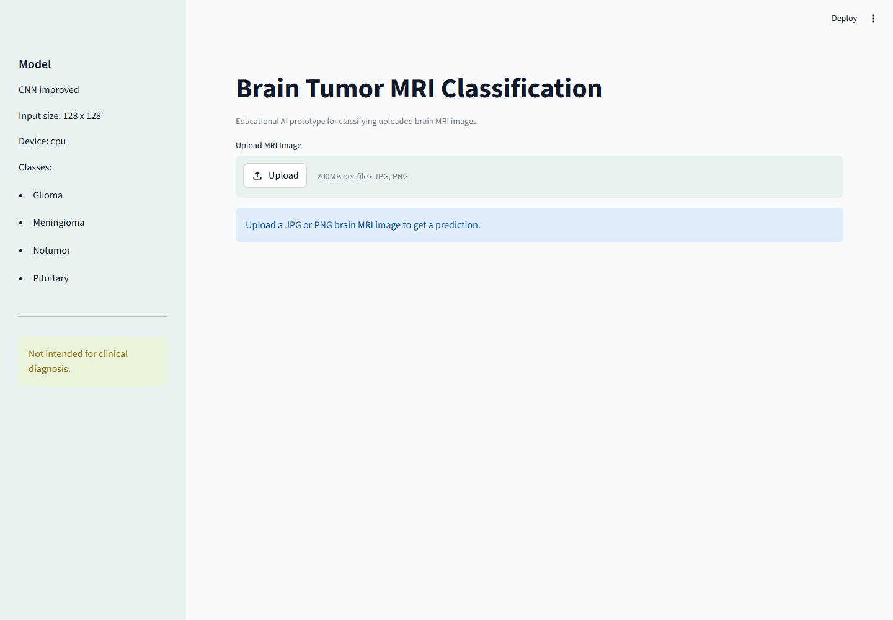
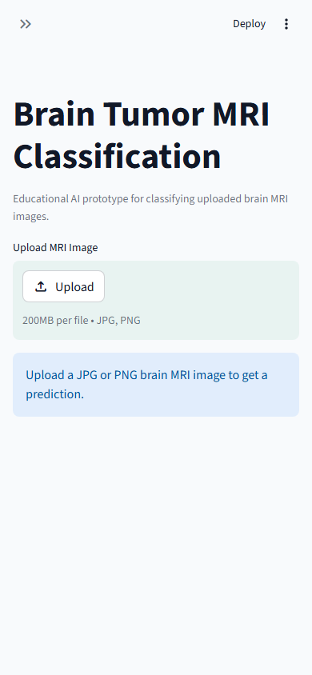

# Brain Tumor MRI Classification

Streamlit application for classifying brain MRI images with a trained CNN checkpoint. The app accepts JPG, JPEG, or PNG MRI images and returns the predicted tumor class, confidence score, and class probabilities.

> This project is for educational and research use only. It is not a medical device and must not be used as a substitute for professional diagnosis.

## Screenshots





## Classes

The bundled checkpoint predicts one of four classes:

- Glioma
- Meningioma
- No tumor
- Pituitary

## Project Structure

```text
.
├── app.py
├── cnn_improved_brain_tumor.pth
├── docs/
│   └── model_card.md
├── screenshots/
│   ├── app-desktop.png
│   └── app-mobile.png
├── .streamlit/
│   └── config.toml
├── requirements.txt
├── run_app.bat
├── run_app.ps1
└── LICENSE
```

## Quick Start

1. Clone the repository:

```bash
git clone https://github.com/Muhammadelzmrany/CNN_brain-mri-classification.git
cd CNN_brain-mri-classification
```

2. Create and activate a virtual environment:

```bash
python -m venv .venv
```

Windows PowerShell:

```powershell
.\.venv\Scripts\Activate.ps1
```

Windows Command Prompt:

```bat
.venv\Scripts\activate.bat
```

3. Install dependencies:

```bash
pip install -r requirements.txt
```

4. Run the app:

```bash
streamlit run app.py
```

Then open:

```text
http://localhost:8501
```

## Model

- Architecture: CNN Improved
- Input size: 128 x 128 RGB image
- Checkpoint: `cnn_improved_brain_tumor.pth`
- Parameters in checkpoint: 2,229,224

More details are available in [docs/model_card.md](docs/model_card.md).

## Notes

- Keep `cnn_improved_brain_tumor.pth` in the project root because `app.py` loads it from that path.
- The app automatically uses CUDA when available, otherwise it runs on CPU.
- Predictions should be reviewed by qualified medical professionals.

